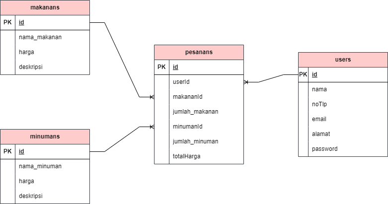

# 🍽️ Online Restaurant - Backend RESTful API

Projek ini adalah sistem Backend komprehensif untuk manajemen Restoran Online yang dibangun menggunakan **Node.js**, **Express.js**, dan **Sequelize ORM**. Projek ini menerapkan prinsip **Functional Programming** menggunakan library **Ramda.js** untuk pengolahan data yang bersih, aman, dan *immutable*.

---

## 🚀 Fitur Unggulan & Implementasi Kode

- **Functional Architecture (Ramda.js):** Penggunaan fungsi deklaratif tingkat lanjut seperti `R.pipe`, `R.compose`, `R.propOr`, `R.add`, dan `R.multiply` untuk kalkulasi harga pesanan serta manipulasi payload data tanpa *side-effects*.
- **Eager Loading Data (Sequelize Relations):** Mengimplementasikan relasi database bertipe *Belongs-to* dan *Has-Many* dengan penyajian respons JSON yang rapi memanfaatkan fitur `include` pada Sequelize.
- **Secure Authentication Middleware:** Pengamanan endpoint privat menggunakan **JWT (JSON Web Token)** yang mengeskstrak payload user secara aman melalui middleware `authUser`.
- **Role-Based Access Control (RBAC):** Memisahkan hak akses pengguna umum dengan pengelola toko melalui middleware khusus `isAdmin` untuk melindungi rute krusial (CRUD Menu).

---

## 🗺️ Entity Relationship Diagram (ERD)

Berikut adalah struktur relasi tabel database yang menghubungkan entitas User, Makanan, Minuman, dan Pesanan pada sistem ini:

---

## 📖 Dokumentasi Lengkap API Endpoints

Semua rute di bawah ini menggunakan base URL: `http://localhost:3000`

### 🔑 Autentikasi Pengguna (`/register`, `/login`)
| Method | Endpoint | Fungsi | Fitur Keamanan |
|--------|----------|--------|----------------|
| **POST** | `/register` | Mendaftarkan akun pelanggan/admin baru | Publik |
| **POST** | `/login` | Autentikasi user dan mendapatkan JWT Token | Publik |

### 🍔 Manajemen Menu Makanan (`/makanan`)
| Method | Endpoint | Fungsi | Fitur Keamanan |
|--------|----------|--------|----------------|
| **POST** | `/makanan` | Membuat menu makanan baru | JWT Valid & Admin Only |
| **GET** | `/makanan` | Mengambil seluruh daftar makanan | Publik |
| **GET** | `/makanan/:id` | Mengambil detail makanan berdasarkan ID | Publik |
| **PUT** | `/makanan/:id` | Mengubah seluruh data makanan | JWT Valid & Admin Only |
| **PATCH** | `/makanan/:id` | Mengubah status/sebagian data makanan | JWT Valid & Admin Only |
| **DELETE** | `/makanan/:id` | Menghapus menu makanan dari sistem | JWT Valid & Admin Only |

### 🛍️ Sistem Transaksi Pesanan (`/pesanan`)
| Method | Endpoint | Fungsi | Fitur Keamanan |
|--------|----------|--------|----------------|
| **POST** | `/pesanan` | Membuat pesanan baru (Otomatis hitung total) | JWT Valid (Semua User) |
| **GET** | `/pesanan` | Mengambil semua riwayat transaksi pesanan | JWT Valid (Semua User) |
| **GET** | `/pesanan/:id` | Mengambil detail struk pesanan tertentu | JWT Valid (Semua User) |
| **PUT** | `/pesanan/:id` | Memperbarui item/jumlah pesanan | JWT Valid (Semua User) |
| **DELETE** | `/pesanan/:id` | Membatalkan/menghapus riwayat pesanan | JWT Valid (Semua User) |

---

